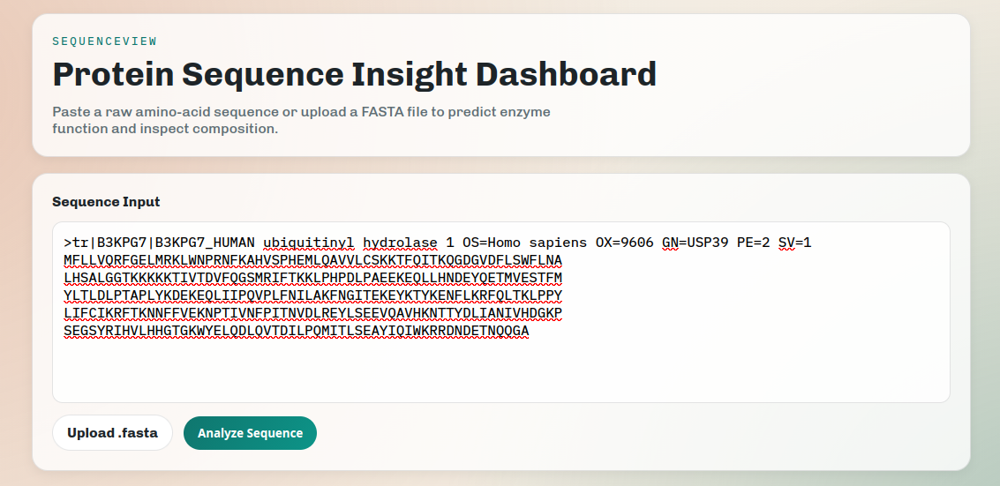
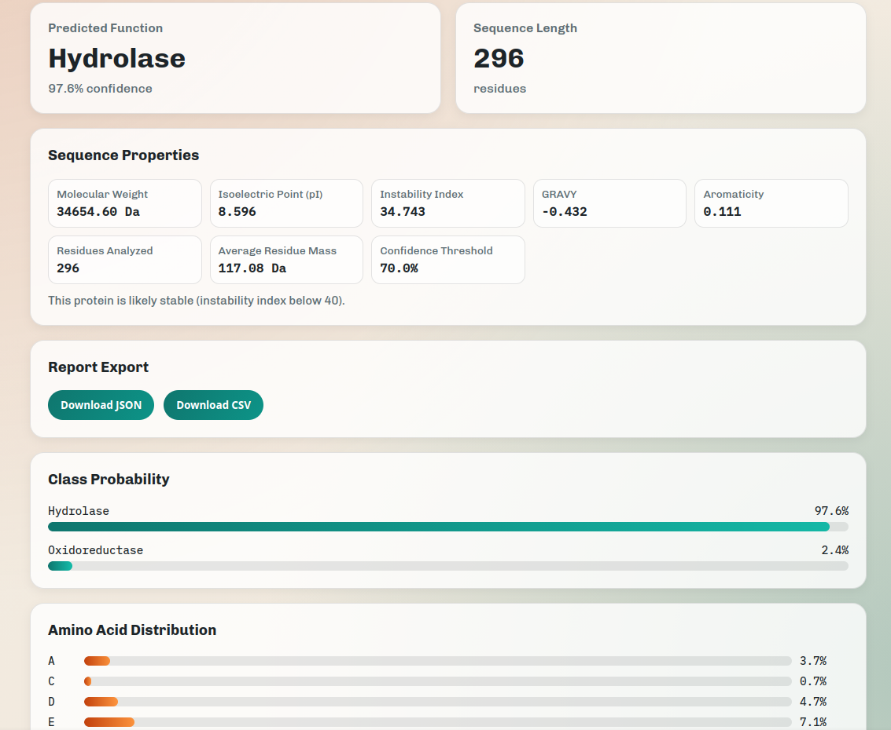

# Sequenceview: Neural-Network Protein Sequence Analysis

## Overview

SequenceView is a full-stack bioinformatics app designed to analyse and classify protein sequences. It combines a custom-trained PyTorch Bidirectional GRU (BiGRU) model for function predictions (Hydrolase EC 1.x vs Oxidoreductase EC 3.x) with a modern React frontend for ease of use




## Features

This app does a couple cool things out of the box:

1. A neural network predicts protein functions using a PyTorch BiGRU model trained on reviewed UniProt entries
2. Leverages biopython to do a biochemical analysis, calculating molecular weight, isoelectric point (pl), GRAVY, and instability index
3. A responsive React frontend featuring sequence validation, amino acid frequency visualization, and FASTA file processing
4. Built-in data export capability to export results to CSV/JSON formats

## Model

This repository is centered on a single Google Colab notebook: [colab_training.ipynb](colab_training.ipynb).

It trains a PyTorch sequence classifier on UniProt amino acid sequences for a narrower binary task:

- `oxidoreductase` (EC 1.*)
- `hydrolase` (EC 3.*)

## Backend

This project includes a Flask backend in [src/sequenceview/app.py](src/sequenceview/app.py) that:

1. Accepts a user-provided protein sequence.
2. Uses Biopython to parse/analyze it (molecular weight, amino acid frequency, and related protein properties).
3. Runs inference with the trained PyTorch classifier.
4. Returns analysis + prediction JSON for frontend consumption.

Currently, it is very powerful with interfacing with the model, using Biopython to infer molecular weight, residues, isoelectric point etc. 

### Backend Files

- [src/sequenceview/app.py](src/sequenceview/app.py): Flask app and HTTP routes.
- [src/sequenceview/sequence_analysis.py](src/sequenceview/sequence_analysis.py): Biopython parsing and sequence statistics.
- [src/sequenceview/model.py](src/sequenceview/model.py): Model architecture, checkpoint loader, and prediction service.

### Install

```bash
pip install -r requirements.txt
```

### Checkpoint Setup

The API expects a trained checkpoint generated by the notebook (`protein_classifier.pt`).

Set the checkpoint path with:

```bash
export SEQUENCEVIEW_CHECKPOINT_PATH=/absolute/path/to/protein_classifier.pt
```

If omitted, the backend defaults to `protein_classifier.pt` in the project root.

### Run API

```bash
PYTHONPATH=src python -m sequenceview.app
```

The API starts on `http://localhost:5000`.

## Frontend (React)

A React dashboard is available in [frontend/](frontend/) for interactive sequence analysis and prediction.

### Run Frontend (Bun)

From the project root:

```bash
cd frontend
bun install
bun run dev
```

The frontend runs on `http://localhost:5173` and proxies `/api` requests to Flask at `http://localhost:5000`.

### Frontend Build

```bash
cd frontend
bun run build
```

After building, Flask also serves the frontend bundle at `http://localhost:5000/`.
You can override the bundle path with:

```bash
export SEQUENCEVIEW_FRONTEND_DIST=/absolute/path/to/frontend/dist
```

### Dashboard Exports

After an analysis is complete, the dashboard can export results as:

- JSON (`sequenceview-report.json`) with full API payload.
- CSV (`sequenceview-report.csv`) with key metrics, probabilities, and amino-acid frequency rows.

### Endpoints

- `GET /health`
	- Returns API readiness and whether the checkpoint is loaded.

- `POST /api/predict`
	- Request body:

```json
{
	"sequence": "MVLSPADKTNVKAA"
}
```

	- Input tips:
		- You can send plain amino acid sequence text or FASTA text.
		- FASTA header lines starting with `>` are ignored automatically.
		- For best results, provide the canonical amino acid sequence only.

	- Response includes:
		- Input sequence
		- Biopython stats (`molecular_weight`, `amino_acid_frequency`, etc.)
		- Model output (`class_name`, class probabilities)
		- Confidence fields (`confidence`, `margin`, `is_uncertain`)

### Confidence Handling

The classifier now marks low-confidence predictions as `uncertain` instead of forcing a hard class.

- `prediction.class_name` is `uncertain` when confidence is below threshold.
- `prediction.predicted_class` still shows the top raw class.
- Default threshold is `0.70` and can be changed via `SEQUENCEVIEW_CONFIDENCE_THRESHOLD`.

## Training Workflow

Open [colab_training.ipynb](colab_training.ipynb) in Google Colab and run Cell 2 with GPU enabled.

The notebook does everything end-to-end:

1. Installs dependencies (`requests`, `torch`).
2. Downloads reviewed UniProt entries for both classes.
3. Caches data to `/content/uniprot_binary_dataset.jsonl`.
4. Splits data with a sequence-identity-aware strategy to reduce leakage.
5. Trains a BiGRU-based classifier with AMP, gradient clipping, and early stopping.
6. Evaluates on a held-out test split.
7. Saves a checkpoint to Google Drive (if mounted) or local Colab storage.

## Outputs

- Per-epoch metrics: `train_loss`, `train_accuracy`, `validation_loss`, `validation_accuracy`
- Final test metrics dictionary
- Saved checkpoint path (default: `/content/drive/MyDrive/protein_classifier.pt`)
- Example inference output for a short amino acid sequence

## Notes

- This is a practical baseline for experimentation, not a production biology model.
- Labels are annotation-derived from UniProt queries and may include noise.
- If you change class counts or split parameters, rerun the training cell to regenerate cache and metrics.
